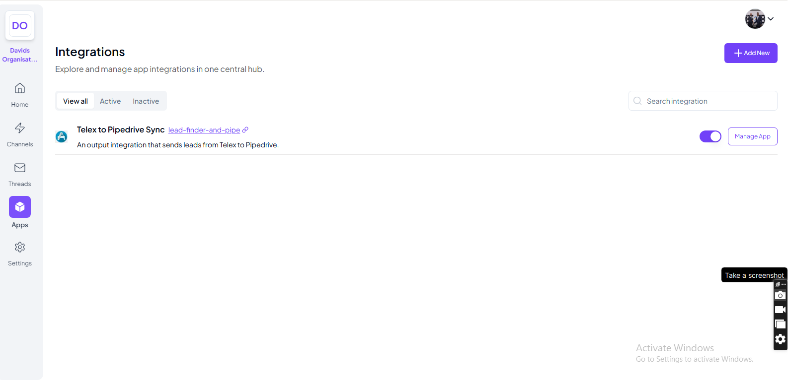

# Lead Finder & Pipedrive Sync

## Overview
This project integrates lead-finding capabilities with Pipedrive, allowing users to search for leads based on role and location, then automatically sync them to Pipedrive. It also integrates with Telex, enabling users to trigger lead searches directly from a Telex channel.

## Features
- Find leads using a role and location.
- Automatically create and associate leads with a person in Pipedrive.
- Telex integration for command-based lead searches.
- User-configurable API keys for Pipedrive and lead-finding services.

## Prerequisites
Before running the application, ensure you have the following installed:
- Python 3.10+
- Flask
- Requests
- dotenv

### Also ensure you have the following api keys ready

- A Pipedrive API key
- A SERP API key (for lead search)

## Setup

### 1. Clone the Repository
```sh
git clone https://github.com/DavidIfebueme/Lead-Finder-and-Pipedrive-Sync
cd Lead-Finder-and-Pipedrive-Sync
```

### 2. Create a Virtual Environment
```sh
python -m venv venv
source venv/bin/activate  # On Windows use `venv\Scripts\activate`
```

### 3. Install Dependencies
```sh
pip install -r requirements.txt
```

### 4. Set Up Environment Variables
Create a `.env` file in the root directory and add the following:
```ini
PIPEDRIVE_API_KEY=your_pipedrive_api_key
SERP_API_KEY=your_serp_api_key
```

### 5. Run the Application
```sh
python run.py
```
The app will be available at `http://localhost:5000`.

## Usage
### Telex Integration

1. First add your api keys for serp api and pipedrive in the settings section
    a default api key is provided for you for serp api
2. click on save "settings" 

3. To search for leads via Telex, enter a message in the activated channel in the following exact format:
```sh
find {role} in {city}
```

for  example
```sh
find developers in enugu
```
The bot will fetch leads and sync them to Pipedrive via your provided Pipedrive api


## Screenshots





## Contributing
Feel free to submit issues or pull requests to improve the project.

## License
This project is licensed under the MIT License.


